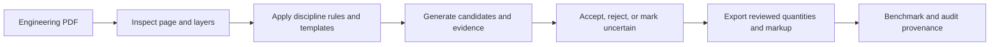

# TakeoffLens

### AI drawing intelligence for reviewed, traceable quantity takeoff

[](https://github.com/anekhirun/Takeoff-Lens/releases/latest)
[](LICENSE)
[](docs/INSTALLATION.md)
[](https://modelcontextprotocol.io/)

TakeoffLens turns engineering drawings into quantities that remain connected to
their source evidence. It combines PDF inspection, vector and layer analysis,
symbol detection, assisted review, markup, and accuracy measurement in one local
MCP-powered workflow.

Electrical and ELV are the first active disciplines. The shared Core +
Discipline architecture is designed to expand to HVAC, Plumbing, Fire
Protection, Architectural, Structural, and other building systems.

> TakeoffLens is an assisted-review product. Automatic detections are candidates,
> not final quantities, until they have been reviewed.

[Download v0.2.0](https://github.com/anekhirun/Takeoff-Lens/releases/latest) ·
[Installation guide](docs/INSTALLATION.md) ·
[Architecture](docs/ARCHITECTURE.md) ·
[Development](docs/DEVELOPMENT.md) ·
[Roadmap](ROADMAP.md)

## Why TakeoffLens

Most PDF tools can display a drawing or extract text. TakeoffLens focuses on the
engineering meaning around that content:

- identifies supported systems and symbol classes;
- uses native vector geometry and PDF/CAD layer evidence when available;
- keeps every counted item tied to page coordinates and review status;
- exports candidate crops, markup, CSV, JSON, and audit evidence;
- records source, template, and candidate hashes for reproducibility;
- measures precision, recall, F1, and where detector misses occurred;
- preserves uncertain items instead of silently converting them into quantities.

## Product capabilities

| Capability | What TakeoffLens provides |
|---|---|
| Read | Inspect vector, hybrid, and raster PDF pages and render them for review |
| Understand | Read project legends, layer signatures, text context, and discipline rules |
| Quantify | Detect supported symbols and group reviewed quantities by page, floor, or region |
| Audit | Keep accepted, rejected, uncertain, unresolved, and manually added locations |
| Trace | Bind results to the PDF, page, template, candidates, and detector settings |
| Measure | Evaluate reviewed detector output with precision, recall, F1, and miss attribution |

## Supported disciplines

| Discipline | Systems | v0.2.0 status |
|---|---|---|
| Electrical | Power, Lighting | Active |
| ELV | Fire Alarm, Data/Voice, CCTV/Security | Active |
| Mechanical | Air Conditioning, Ventilation | Planned |
| Plumbing | Water Supply, Drainage, Sanitary | Planned |
| Fire Protection | Sprinkler, Hydrant, Fire Pump | Planned |
| Architectural | Door, Window, Room, Finish | Planned |
| Structural | Column, Beam, Foundation | Planned |

`get_discipline_catalog` is the machine-readable source of truth. Planned packs
must not be presented as supported until their rules, templates, and reviewed
benchmarks are available.

## How it works



The engine prefers CAD metadata when available, native vector geometry for
vector PDFs, and high-resolution visual review for raster scans. OCR is text
context only; it is not treated as proof that a symbol exists.

## Quick start

### Install as a Codex Plugin

1. Download `takeoff-lens-plugin-v0.2.0.zip` from the
   [latest release](https://github.com/anekhirun/Takeoff-Lens/releases/latest).
2. Verify the accompanying `.sha256` file.
3. Extract the archive.
4. Add the extracted `plugin-marketplace` directory to Codex.
5. Install `takeoff-lens`, then start a new task so the Skill and MCP tools load.

The first MCP launch creates a private per-user Python environment and installs
the pinned headless dependencies. Drawing files are processed locally.

See [Installation](docs/INSTALLATION.md) for exact commands, migration from the
legacy plugin, manual MCP setup, managed Python environments, and troubleshooting.

### Example prompt

```text
Use TakeoffLens to inspect this engineering PDF.
Prepare a FIRE_ALARM audit, create markup, and review every candidate.
Keep uncertain locations unresolved and show their crop or coordinates before
reporting a final quantity.
```

## Review contract

A result is final only when all of the following are true:

- every detector candidate has an accepted, rejected, or uncertain decision;
- no unresolved or uncertain item affects the subtotal;
- the independent wall and door sweep is confirmed where relevant;
- `review_complete` is `true`;
- `clarification_required` is `false`;
- `provenance_verified` is `true`.

Visually confirmed misses are recorded as `manual_points`; they are never added
silently. A zero result remains provisional until the candidate set and relevant
plan regions have been reviewed.

## Output artifacts

TakeoffLens can produce:

- `candidates.json` and candidate crops;
- `candidate_pool.json` with shortlisted, filtered, and ranked-out records;
- `detection_manifest.json` with SHA-256 provenance;
- an HTML candidate review page;
- confirmed CSV and JSON quantities;
- marked-up page images with stable detection IDs;
- accuracy reports containing TP, FP, FN, precision, recall, and F1.

## Accuracy status

The current benchmark foundation rejects incomplete ground truth and verifies the
source PDF hash before evaluation. The first private reviewed Fire Alarm baseline
covers eight symbol classes and ten confirmed locations on one vector sheet.
Layer-aware filtering reduced false positives from 83 to 25 while preserving
recall at `1.000`; shortlist precision is `0.286` and F1 is `0.444`.

This is a regression baseline for one sheet, not a general production-accuracy
claim. Broader multi-project benchmark coverage is part of the roadmap.

## MCP tools

| Tool | Purpose |
|---|---|
| `get_discipline_catalog` | Report active and planned disciplines |
| `inspect_drawing` | Profile PDF pages before analysis |
| `render_page` | Render a page for visual review |
| `get_symbol_rules` | Return supported symbol and context rules |
| `build_symbol_template` | Build a project template from a clean legend ROI |
| `analyze_vector_layers` | Analyze rotation-normalized vector signatures |
| `detect_symbol_candidates` | Generate candidates and review artifacts |
| `confirm_symbol_count` | Record decisions and export audited quantities |
| `prepare_sheet_audit` | Prepare one supported system in a shared-context pass |
| `evaluate_detection_accuracy` | Evaluate reviewed detector output |

## Privacy and project data

- Drawings are processed locally by the bundled MCP server.
- The repository and public release do not include customer PDFs, DWG/DXF files,
  marked-up plans, private ground truth, test outputs, or machine-specific paths.
- Private benchmark suites should remain under ignored directories such as
  `test-runs/`.
- Network access is needed only for first-run dependency installation unless a
  managed Python environment is supplied.

## Platform and limitations

- The packaged launcher currently targets Windows and PowerShell.
- The vector matcher is intended mainly for vector and hybrid PDFs.
- Raster scans require high-resolution tiling and a separate vision/object
  detection workflow; this is not yet a production feature.
- Symbol geometry varies by company and project, so project legend confirmation
  remains essential.
- The optional Windows Desktop App is experimental. Product development currently
  prioritizes the MCP + Skill workflow.

## Development

TakeoffLens is implemented in Python with PyMuPDF, OpenCV, NumPy, and Pillow.
Start with [Development](docs/DEVELOPMENT.md) for setup, tests, validation,
benchmarking, packaging, and repository safety rules. See
[Architecture](docs/ARCHITECTURE.md) for the Core, MCP, Discipline Pack, and
host-adapter boundaries.

## Release history

See [CHANGELOG.md](CHANGELOG.md). The current public release is
[TakeoffLens v0.2.0](https://github.com/anekhirun/Takeoff-Lens/releases/tag/v0.2.0).

## License

[MIT](LICENSE)
