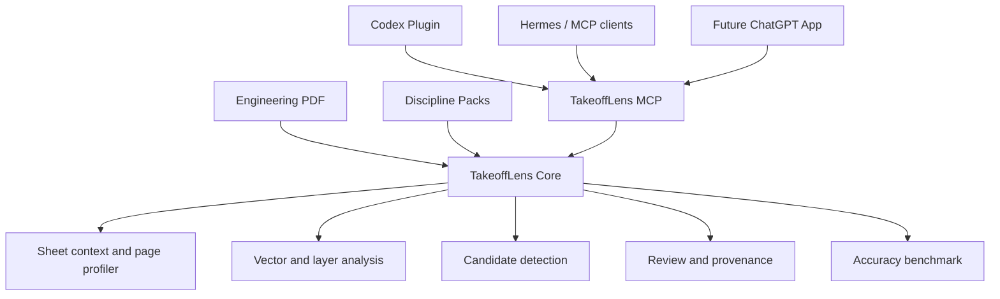

# TakeoffLens architecture

TakeoffLens separates engineering-drawing intelligence from the host that calls
it. The product Core owns document evidence and quantity semantics; Plugins and
Apps are distribution adapters.

## Component model



## Core responsibilities

- inspect and classify drawing pages;
- extract reusable native vector geometry and text context;
- analyze layer signatures without guessing equipment names;
- detect symbol candidates using starter or project-specific templates;
- retain every shortlisted, filtered, and ranked-out candidate;
- bind output to source and template hashes;
- record review decisions and manual additions;
- evaluate reviewed ground truth.

Core behavior must not depend on Codex UI, a specific model provider, or a
desktop window.

## Discipline Packs

A Discipline Pack defines:

- discipline and system IDs;
- supported symbol IDs and display names;
- legend and context rules;
- preferred layer tokens;
- starter or project-template requirements;
- counting and review rules;
- reviewed benchmark coverage.

Electrical and ELV are active in v0.2.x. Planned packs remain visible through
`get_discipline_catalog` but cannot be passed to `prepare_sheet_audit` until
implemented.

## Shared sheet context

`SheetContext` extracts the page once and reuses:

- vector primitives;
- normalized descriptors;
- PDF words and text boxes;
- layer metadata;
- spatial indexes;
- page profile evidence;
- optional rendered image data.

This allows several symbol detectors to share one native page preparation pass.

## Candidate lifecycle

```text
geometry match
  -> contextual filtering
  -> non-maximum suppression
  -> shortlist or ranked-out pool
  -> visual review
  -> accepted / rejected / uncertain
  -> manual sweep and additions
  -> provenance verification
  -> final quantity export
```

Filtered candidates remain in `candidate_pool.json`. They are not silently
discarded, which allows benchmark reports to distinguish filtering misses from
shortlist-limit misses.

## Provenance boundary

Every detection run creates `detection_manifest.json` containing the PDF hash,
page, symbol ID, template hash, candidate hashes, detector parameters, and page
profile. Confirmation fails if the source, template, page, symbol, or candidates
do not match the manifest.

Legacy candidate files may still be inspected, but cannot produce a final
`review_complete` result without verified provenance.

## Transport and host adapters

v0.2.x provides a local stdio MCP transport and a Codex Plugin package.

Planned adapters include:

- a documented Hermes configuration;
- remote Streamable HTTP MCP;
- a ChatGPT App adapter;
- additional MCP-compatible hosts;
- optional REST integration for non-MCP systems.

Host adapters should expose the same tools and output contracts rather than
reimplementing detection logic.

## Data and privacy

The packaged server operates locally. Source drawings, project templates,
private ground truth, and generated reports are user data and must remain
outside the public repository and release archive.
